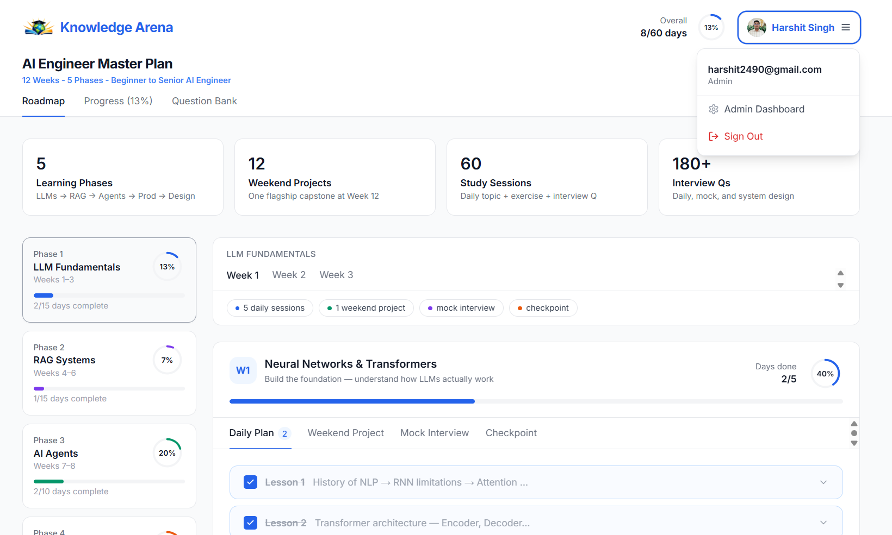
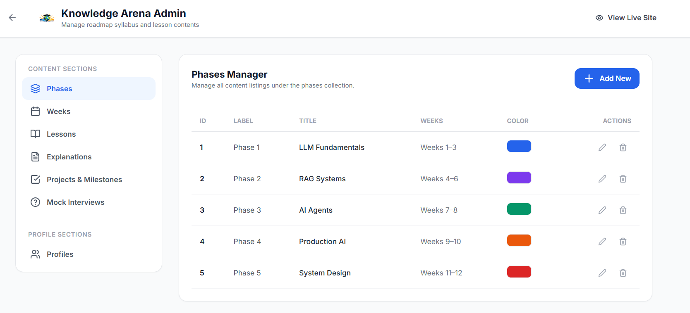
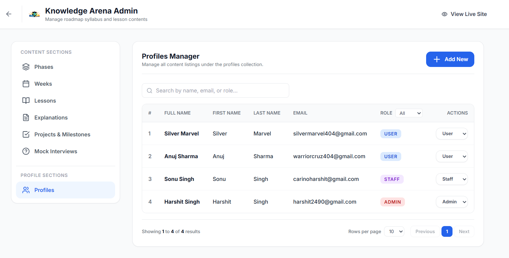

# 🚀 AI Roadmap CMS

> A structured learning platform with an integrated Admin CMS. Master AI engineering week-by-week while administrators manage course content dynamically and handle role-based user profiles seamlessly.


---

## 🌐 Live Demo
**[Launch AI Roadmap CMS Application](https://ai-roadmap-cms-app.netlify.app)**

---

<a id="table-of-contents"></a>
## 📑 Table of Contents

1. [Project Overview](#1-project-overview)
2. [Visual Walkthrough](#2-visual-walkthrough)
3. [Key Features](#3-key-features)
4. [Architecture & Tech Stack](#4-architecture--tech-stack)
5. [Installation & Local Setup](#5-installation--local-setup)
6. [Deployment](#6-deployment)

---

## 1. Project Overview

**AI Roadmap CMS** is a full-stack learning management application tailored for AI engineering students. It provides a guided, week-by-week curriculum tracking system for users, while offering a robust Content Management System (CMS) for administrators to update phases, lessons, and interview questions on the fly. 

The application implements secure role-based access control (RBAC), ensuring that only authorized administrators can modify the curriculum or change user roles.

---

## 2. Visual Walkthrough

### 🎓 Learning Dashboard
The core student experience. Users can track their progress, view weekly milestones, and explore the AI engineering curriculum.


### 🛠️ Admin CMS
Administrators can dynamically manage the curriculum, updating lessons, weeks, and phases directly through the intuitive CMS interface without touching the database.


### 👥 Profile Role Management
The profile management section allows admins to seamlessly search, filter, and modify user roles (User, Staff, Admin) utilizing TanStack Table for blazing-fast performance.


---

## 3. Key Features

- **Profile Role Management**: Manage access with instant UI updates. Search and filter users by name or email, and assign roles (Admin, Staff, User) directly from the data table.
- **Dynamic Content Management (CMS)**: Add, edit, and delete curriculum phases and weeks via the admin portal.
- **Interactive Roadmap Tracking**: Students can visualize their 12-week AI journey and track progress persistently.
- **Complete Supabase Integration**: 
  - **Auth**: Google OAuth and email login.
  - **Postgres**: Highly relational database for curriculum data.
  - **RLS (Row-Level Security)**: Strict data protection preventing unauthorized edits.
- **Pagination & Global Filtering**: Handled on the client-side via TanStack React Table for instant data interactions.

---

## 4. Architecture & Tech Stack

### Frontend
- **Framework**: React 18 + React Router v7 (SPA Mode)
- **Styling**: Tailwind CSS + Lucide React (Icons)
- **State & Tables**: TanStack React Table
- **Build Tool**: Vite

### Backend (BaaS)
- **Database**: PostgreSQL (via Supabase)
- **Authentication**: Supabase Auth (Google OAuth enabled)
- **Security**: PostgreSQL Row-Level Security (RLS) and SQL Triggers

### Data Flow
1. **Auth Context**: Wraps the application, providing real-time session state and intercepting Google OAuth metadata (splitting `full_name` into `firstName` and `lastName`).
2. **Protected Routes**: React Router guards `/admin` routes, verifying the user's `role` against the Supabase `profiles` table.
3. **Database Interactions**: Direct secure communication from client to Supabase REST endpoints, protected by RLS policies ensuring users can only edit their own profiles unless they are an admin.

---

## 5. Installation & Local Setup

### Prerequisites
- Node.js 22 or higher
- A Supabase Project (Free Tier works perfectly)

### Step 1: Clone the repository
```bash
git clone https://github.com/your-username/ai-roadmap.git
cd ai-roadmap
```

### Step 2: Install dependencies
```bash
npm install
```

### Step 3: Database Setup
1. Open your Supabase project's SQL Editor.
2. Run the SQL schema found in `supabase/01_schema.sql`.
3. Run the seed data script found in `supabase/02_seed_data.sql`.

### Step 4: Environment Variables
Create a `.env` file in the root directory and add your Supabase keys:
```env
NEXT_PUBLIC_SUPABASE_URL=your_supabase_project_url
NEXT_PUBLIC_SUPABASE_ANON_KEY=your_supabase_anon_key
```

### Step 5: Start the development server
```bash
npm run dev
```
Your app will be running at `http://localhost:4000`.

---

## 6. Deployment

This project is configured for seamless deployment on **Netlify** using a Single Page Application (SPA) configuration. Follow these steps to deploy:

### Step 1: Push Your Code to GitHub
Ensure your code is pushed to a GitHub repository (private is recommended since your Supabase keys are in env vars).
```bash
git remote add origin https://github.com/YOUR_USERNAME/ai-roadmap.git
git branch -M main
git push -u origin main
```

### Step 2: Deploy on Netlify
1. Go to [app.netlify.com](https://app.netlify.com) and log in with GitHub.
2. Click **"Add new site"** → **"Import an existing project"**.
3. Select your `ai-roadmap` repository.
4. Netlify will auto-detect the settings from your `netlify.toml`:
   - **Build command**: `npm run build`
   - **Publish directory**: `build/client`
5. Go to **"Advanced build settings"** and add your environment variables:
   - `NEXT_PUBLIC_SUPABASE_URL`: Your Supabase project URL
   - `NEXT_PUBLIC_SUPABASE_ANON_KEY`: Your Supabase anon key
6. Click **"Deploy site"**.

### Step 3: Update Supabase Auth Redirect URL
After Netlify assigns your site URL (e.g., `https://your-site.netlify.app`):
1. Go to your **Supabase Dashboard** → **Authentication** → **URL Configuration**.
2. Add your Netlify URL to **Redirect URLs**:
   ```text
   https://your-site.netlify.app
   https://your-site.netlify.app/**
   ```

---

## 7. Adding Future Features (Continuous Deployment)

Since Netlify is connected to your GitHub repo, every push to `main` will **auto-deploy**. Your workflow for new features:

```bash
# 1. Create a feature branch
git checkout -b feature/my-new-feature

# 2. Make your changes, then commit
git add -A
git commit -m "Add my new feature"

# 3. Push to GitHub
git push origin feature/my-new-feature

# 4. Create a Pull Request and merge to main
git checkout main
git merge feature/my-new-feature
git push origin main
# → Netlify auto-deploys in ~30 seconds
```

> [!TIP]
> Netlify creates **Deploy Previews** for every Pull Request. This lets you test changes on a temporary URL before merging to production.

---

## 8. Project Structure Recap

```text
ai-roadmap/
├── netlify.toml          ← Netlify build config
├── react-router.config.ts ← SPA mode (ssr: false)
├── package.json          ← build script added
├── .gitignore            ← env files, node_modules, build excluded
├── src/                  ← Your app code
└── supabase/             ← Database schema & seed data
```

---

## 9. Troubleshooting

| Issue | Fix |
|-------|-----|
| **Blank page after deploy** | Check that env vars are set in Netlify dashboard |
| **404 on page refresh** | The `[[redirects]]` in `netlify.toml` handles this (SPA fallback) |
| **Google login not working** | Add your Netlify URL to Supabase Auth redirect URLs |
| **Build fails** | Check Netlify build logs; ensure Node 22 is being used (`NODE_VERSION="22"`) |

